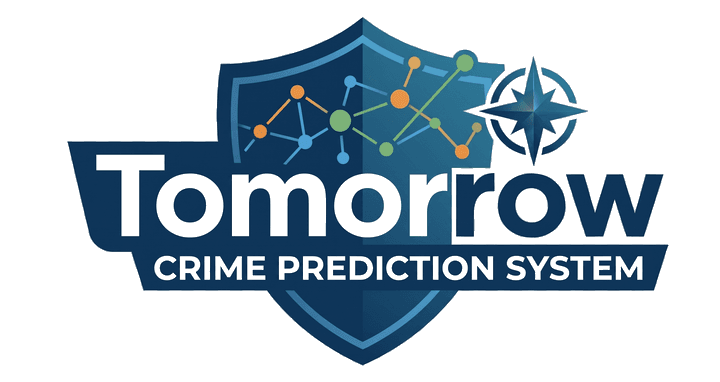
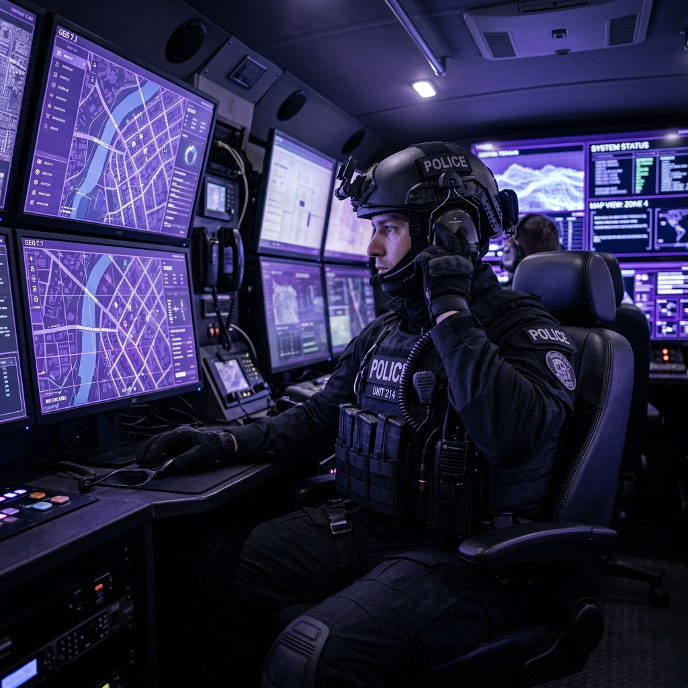
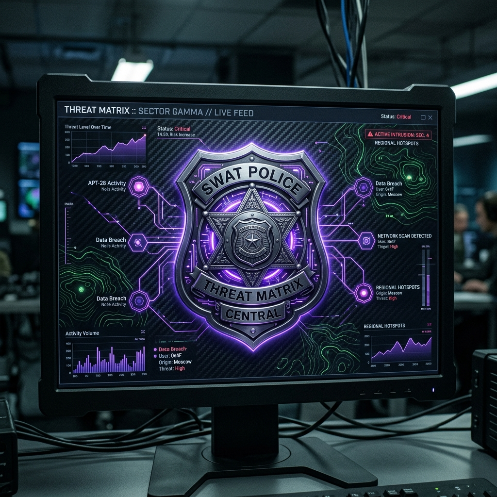
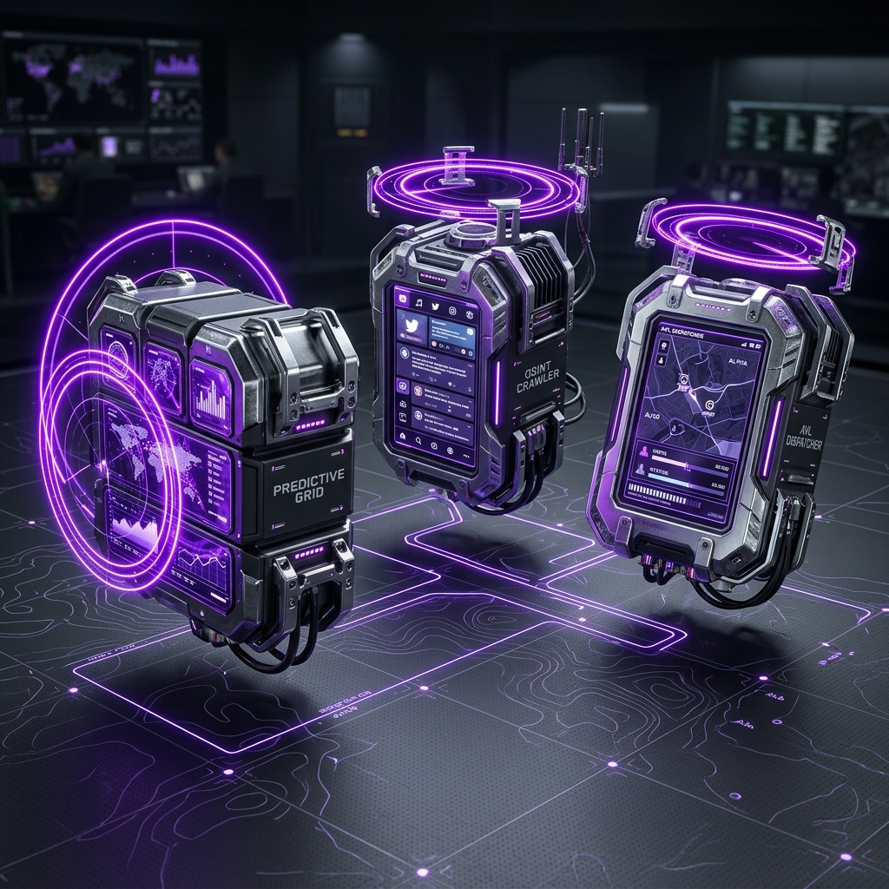
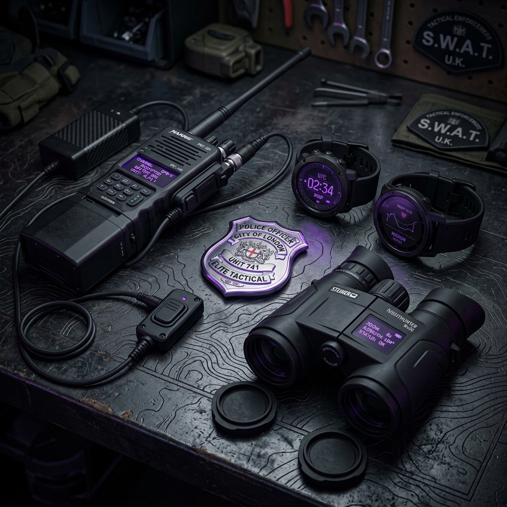
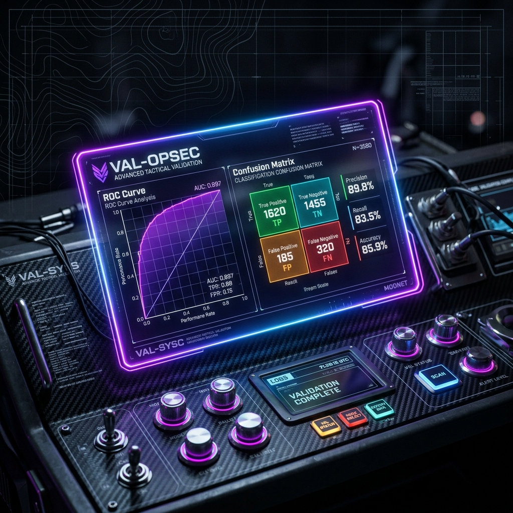

# TOMORROW — B2B Enterprise Product Brochure



---

## Slide 1: Cover Page
### **TOMORROW**
**District Crime Prediction & Tactical Fusion Platform**
*High-End Enterprise Predictive Policing Command Center*

> **Global Intelligence, Local Prevention.**
> *A data-driven, preemptive command and control system designed for modern law enforcement.*

---

## Slide 2: Introduction
### **Preemptive District Intelligence**
*Anticipate, allocate, and secure the municipal sector.*

> **"When we predict tomorrow, we prevent crime today."**

We are here to ensure that your district's operational resources are dispatched to the exact right places, at the exact right times. **Tomorrow** enables command centers to preempt incidents, optimize police patrol distribution, and create a visible, scientific layer of deterrence before the first emergency call is ever placed.

---

## Slide 3: Mission Statement
### **Helping Police Protect Their Cities**
*Bridging raw data and field operations.*

The **Tomorrow** platform integrates multi-layered historical, contextual, and open-source intelligence (OSINT) to provide dispatchers and commanders with an actionable, preemptive district threat grid.

* **Micro-Level Spatial Accuracy:** Tactical patrol grids divided into ultra-precise 150m x 150m risk cells.
* **Real-Time Open-Source Fusion:** Automated scanning and NLP entity extraction from public networks and channels.
* **Proportional AVL & Mutual Aid:** Distance-based patrol vehicle routing with dynamic cross-station resource sharing.
* **Explainable AI (XAI) Patrol Orders:** Single-click official printable patrol briefs with transparent risk reasoning.



---

## Slide 4: Threat Landscape
### **The Urban Threat Grid**
*Traditional policing models are no longer sufficient.*

Reactive policing (dispatching officers *after* a crime has been reported) is no longer sufficient to counter sophisticated, rapidly moving urban threats.

Property burglary, auto theft, assault, and public disorder are highly dynamic. They are influenced by a complex web of calendar events, environmental factors, and real-time social signals. To achieve true deterrence, commanders must possess tools that anticipate these vectors.

---

## Slide 5: Tactical Fusion Vectors
### **Multi-Layered Threat Fusion**
*Dynamic data convergence inside a single prediction engine.*

**Tomorrow** synthesizes five distinct environmental, historical, and real-time data streams into a single, cohesive district risk score:

```
                            ┌──────────────────────────┐
                            │  Historical Crime Records│
                            └─────────────┬────────────┘
                                          │
 ┌─────────────────────────┐              ▼              ┌─────────────────────────┐
 │  Temporal Peak Patterns ├───────►  [ TOMORROW ]  ◄────┤ Environmental GIS Layers│
 │  (Hour, Weekend Uplift) │       │  Prediction  │      │(Nightlife, ATMs, Lights)│
 └─────────────────────────┘       │    Engine    │      └─────────────────────────┘
 ┌─────────────────────────┐              ▲              ┌─────────────────────────┐
 │ Strategic Calendar Events├──────────────┼─────────────┤ Real-Time OSINT Signals │
 │ (Protests, Arena matches)│              │             │(Social Media, Telegram) │
 └─────────────────────────┘              │             └─────────────────────────┘
                                          ▼
                            ┌──────────────────────────┐
                            │ Tactical Threat Grid(DTI)│
                            └──────────────────────────┘
```



---

## Slide 6: Traditional Overview
### **Why Static Heatmaps Fail**
*Operational bottlenecks in conventional crime-mapping tools.*

* **Outdated Reports (Weekly Delays):** Static heatmaps are updated days or weeks after crimes occur, rendering them useless for immediate tactical patrol planning.
* **Context Blindness (No Context):** Classic databases have no awareness of ongoing public protests, major stadium events, or missing streetlighting in high-risk alleys.
* **Black Box Dispatches:** Traditional ML models do not explain *why* an area is high-risk, leaving patrol officers without tactical guidance or explanations.

---

## Slide 7: The Disruption
### **Redefining Patrol Management**
*A side-by-side comparison of old and new methodologies.*

| Capability | Traditional Static Heatmaps | The TOMORROW Platform |
| :--- | :--- | :--- |
| **Update Cadence** | Weekly / Monthly | **Real-Time Dynamic (24-Hour Scrubber)** |
| **Environmental Context** | Historical records only | **RTM Active Layers (ATMs, Lights, Pubs)** |
| **Social Intelligence** | Manually reviewed after hours | **Automated OSINT Crawler & Spatial Boost** |
| **Decision Transparency** | Black-box opacity | **Explainable AI (XAI) Factor Breakdown** |
| **Fleet Coordination** | Manual voice dispatch | **Proportional AVL Routing & Mutual Aid** |

---

## Slide 8: Strategic Market Position
### **Market & Tactical Positioning**
*Maximum prevention coupled with real-time tactical action.*

```
  Preemptive Actionability (Prediction Engine)
  ▲
  │                                                   [TOMORROW]
  │                                              Maximum Protection &
  │                                            Dynamic Tactical Dispatch
  │
  │                    [Lookout/GIS]
  │                  Traditional Map Layers
  │
  │
  ├─────────────────────────────────────────────────────────────────► Operational Readiness
  │                                                                   (Real-Time Action)
  │
  │     [Standard Call Logs]
  │    Reactive Post-Incident Logs
  │
```

---

## Slide 9: Smart Modular Suite
### **Smart Modular Suite**
*Advanced core pillars working in absolute synergy.*

* **Predictive Hotspot Grid:** Divides the municipal sector into a highly visible 150m grid. Powered by a high-fidelity Gradient Boosting Machine (GBM) ML engine that analyzes crime records, lighting, weather anomalies, and strategic calendar events to calibrate a dynamic District Threat Index (DTI) for each hour of the shift.
* **Multi-Source OSINT Fusion Layer:** An automated background crawler that scans public Telegram channels, WhatsApp groups, X (Twitter), Reddit, and local forums. Using advanced NLP entity extraction, it automatically isolates geo-coordinates and applies localized spatial boosts (up to 600m) to the threat grid.
* **Smart AVL & Mutual Aid Dispatcher:** Tracks active patrol vehicle positions in real-time, automates curvilinear Bezier routing on the map, and utilizes an intelligent allocator to coordinate cross-station resource sharing when local sectors hit zero availability.



---

## Slide 10: High-End B2B Advanced Capabilities
### **Closing The Tactical Loop**
*Autonomous, AI-driven responses transforming data points into physical security.*

* **AI Dispatch Co-Pilot:** An integrated LLM agent that analyzes incoming incidents in real-time, cross-references historical spatial forecasts, and provides dispatchers with instant tactical briefs and optimized unit recommendations.
* **Autonomous UAV Interceptor Layer:** High-risk predictions automatically trigger autonomous drone launches from municipal docking nests, providing real-time aerial surveillance and visual deterrence over crime hotspots.
* **Cellular Triangulation & Anomaly Detector:** Real-time cellular tracking and movement anomaly detection that flags unusual traffic patterns or unauthorized presence of flagged individuals in restricted municipal zones.
* **Explainable AI (XAI) Patrol Briefs:** One-click generation of official, print-ready tactical briefs with transparent risk factor breakdowns (History, OSINT, Weather, Temporal) to guide field officers.

---

## Slide 11: Use Case 1: Tactical Crowd & Event Control
### **Crowd & Event Control**
*Managing high-risk sectors during massive city-wide rallies.*

> **Scenario:** A massive public demonstration at the Central Metropolitan Hub increases property disorder risks in surrounding sectors, straining local police resources.

**The Tomorrow Resolution:**
1. The dispatcher activates the **"Metropolitan Protest"** layer in the Strategic Events control panel.
2. The multi-factor ML engine instantly recalibrates, applying real-time crime boosts to the affected 150m grid cells.
3. The interactive map dynamically highlights high-risk sectors in warning colors, breaking down the specific risk indicators (XAI).
4. The commander prints official tactical patrol briefs for the high-risk zones, automatically saturating the area with preventive units.


---

## Slide 12: Use Case 2: Stolen Vehicle Interception
### **LPR Vehicle Interception**
*Resolving high-priority stolen vehicle hits via Mutual Aid dispatches.*

> **Scenario:** A stolen vehicle is flagged by an LPR camera in the high-density Residential Sector. The local precinct (Precinct B Station) has zero available units due to active dispatches.

**The Tomorrow Resolution:**
1. The real-time LPR alert feed receives an active hit from camera node 17, cross-referenced against the national database.
2. The dispatcher triggers the closed-loop **"Dispatch" sequence** directly from the alert interface.
3. The **Mutual Aid** allocator scans neighboring precincts and identifies an available patrol unit at Precinct A Station.
4. The AVL system dispatches the Precinct A unit, animating its curvilinear path directly from its actual coordinates with glowing radar rings.
5. The patrol unit arrives at the LPR camera site, apprehends the suspect, secures the scene, and automatically updates the alert status to `Secured` in green.

---

## Slide 13: Tactical Summary
### **Scientific Deterrence Layer**
*More than a tactical map — Tomorrow is an active prevention platform.*

The **Tomorrow** platform bridges the gap between raw intelligence and physical field operations. It empowers police commanders to make data-backed deployment decisions, validate prediction accuracy via the Backtesting simulator, and create an active layer of safety that saves resources and protects urban communities.



---

## Slide 14-17: Technical Deep-Dive
### **Module Specifications**
*Under the hood of Tomorrow's high-tech production infrastructure.*

* **Prediction Engine (prediction.js):** A multi-factor Gradient Boosting Machine (GBM) model combining historical records, public lighting levels, weather indexes, and live 911 calls with geographic coastline clamping.
* **OSINT & Web Crawler (osint.js):** Background scanner executing MTProto userbots and web scrapers to crawl Telegram, WhatsApp, and social media. Uses custom NLP for location extraction and applies up to a 600m spatial grid boost to prediction threat scores.
* **Intelligence & Cellular Fusion:** API integrations with cellular triangulation feeds and prisoner/parolee databases, mapping anomalies and authorized zone breaches directly onto a unified suspect profile panel.
* **Smart AVL Dispatcher (dispatch.js):** Curvilinear Bezier pathing to coordinate active fleets, dynamic radar pulsing, and distance-proportional travel speeds with automated cross-station Mutual Aid resource sharing.

---

## Slide 18: Model Validation Dashboard
### **Accurate Model Backtesting**
*Scientific proof of platform hit-rates and prediction accuracy.*

Designed for procurement officers, chiefs, and analysts:

* **Confusion Matrix:** Displays true positives, false positives, false negatives, and true negatives.
* **ROC Curve Canvas:** Dynamic plot drawing the Receiver Operating Characteristic curve in real-time.
* **Replay & Recalibrate:** Simulates 30 days of past dispatches and actual crime occurrences, showing the platform's high-tech hit-rate.



---

## Slide 19: Technology Stack
### **The Platform Stack**
*Built with enterprise-grade, lightweight, and high-performance Web APIs.*

* **Frontend Core:** HTML5, CSS3 with glassmorphic backdrop filters, custom SVG topographic overlays, and Vanilla JS (IIFE Module structure).
* **Mapping Framework:** Leaflet JS + CartoDB Dark Tiles + Leaflet.heat (dynamic crime heatmaps).
* **Real-time Sync & Integration:** Firebase Realtime Database, MTProto userbot, and National Law Enforcement REST APIs.

---

## Slide 20: Contact Page
### **Tomorrow's Security, Today's Strategy**
*Contact our development & procurement team for scheduling a demo.*

* **Development Director:** ELCHAI FINE
* **Marketing Director:** B. General (r) Guy Nir
* **B2B Sales & Marketing Phone:**
  * GUY: +972-50-627-8071
  * ELCHAI: +972-54-201-2000
* **Platform URL:** [elchai.github.io/Tomorrow](https://elchai.github.io/Tomorrow/)
